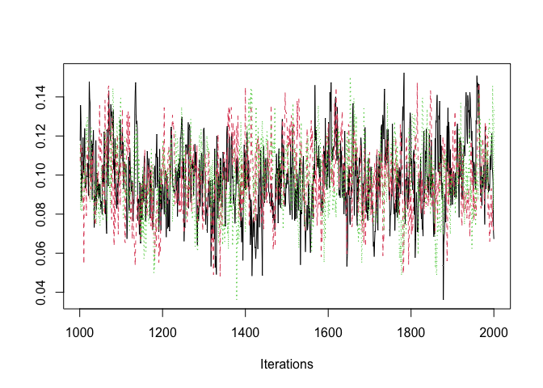
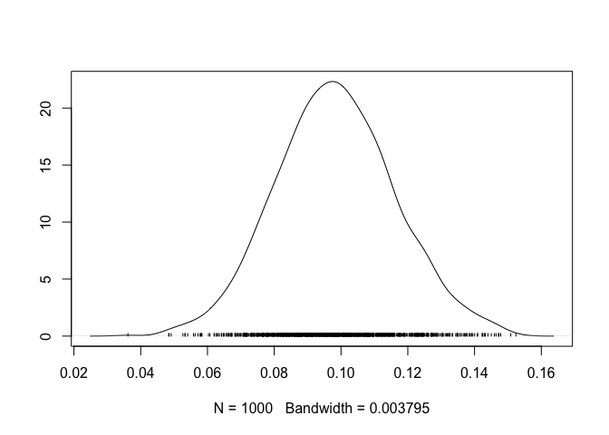

# mrhorse

<!-- badges: start -->
[](https://github.com/natalieparent9/mrhorse/actions/workflows/R-CMD-check.yaml)
<!-- badges: end -->

Provides the R code to implement the methods described in:

Grant, AJ and Burgess, S (2024). [A Bayesian approach to Mendelian
randomization using summary statistics in the univariable and
multivariable settings with correlated
pleiotropy](https://doi.org/10.1016/j.ajhg.2023.12.002). *American
Journal of Human Genetics*. 111(1):165-180. doi:
<https://doi.org/10.1016/j.ajhg.2023.12.002>

The paper introduces a method for performing both univariable and
multivariable Mendelian randomization to examine the causal effect of
one or more exposures on an outcome using genetic association data. The
methods take as input estimates of the associations between genetic
instruments and the exposure(s) and outcome from GWAS summary
statistics. Causal effect estimation is performed in a Bayesian
framework using a horseshoe shrinkage prior to account for both
correlated and uncorrelated pleiotropic effects.

## Installation

In order to run the code,
[JAGS](https://sourceforge.net/projects/mcmc-jags/) first needs to be
installed.

You can install the development version of mrhorse from
[GitHub](https://github.com/) with:

``` r
library(devtools)
devtools::install_github("natalieparent9/mrhorse")
library(mrhorse)
```

## Implementation

The function `mr_horse()` implements the univariable MR-Horse method.
The required input is a data frame with column headings:

- `betaY`: estimate of genetic association with the outcome
- `betaYse`: standard error of the estimate of genetic association with
  the outcome
- `betaX`: estimate of genetic association with the exposure
- `betaXse`: standard error of the estimate of genetic association with
  the exposure

Each row in the data frame represents a genetic variant.

Optional arguments are:

- `n.chains`: number of chains to run (default = 3)
- `variable.names`: vector of parameters to save in the MCMC output. The
  causal effect is “theta”, and will always be saved. Other relevant
  parameters include “alpha” (pleiotropic effects for each genetic
  variant) and “rho” (correlations between pleiotropic effects and
  genetic variant-exposure effects for each variant)
- `n.iter`: number of iterations (in addition to burn-in, default =
  10000)
- `n.burnin`: number of iterations for burn-in (default = 10000)
- `stan`: fit the model using rstan (default = FALSE, uses JAGS)
- `n.cores`: number of cores to use in parallel when running multiple
  chains (default = parallelly::availableCores())

Output from the `mr_horse()` function include:

- `$MR_Estimate`: a data frame with the causal effect estimate (which is
  the posterior mean), standard deviation (i.e., the posterior standard
  deviation), upper and lower bounds of the 95% credible interval, and
  the R-hat value
- `$MR_Coda`: full MCMC samples for all parameters in `variable.names`

JAGS plotting tools can be used with the MCMC output, for example using
`traceplot()` and `densplot()`.

The function `mvmr_horse` implements the multivariable MVMR-Horse
method. The required inputs are as above, but where `betaX` is replaced
by the K columns `betaX1`, `betaX2`, …, and `betaXse` is replaced by the
K columns `betaX1se`, `betaX2se`, … .

## Examples

### Univariable MR

The csv file dat_ex.csv contains a dataframe containing simulated
genetic association estimates between 100 genetic instruments and an
exposure and outcome, as well as their corresponding standard errors.
This is taken from the first replication of the first simulation study
(that is, where 20% of variants are pleiotropic, and pleiotropy is
balanced). The dataset can be analysed as follows.

``` r
set.seed(20230531)
MREx = mr_horse(data_ex, n.iter=1000, n.burnin=1000)
MREx$MR_Estimate
#>   Estimate    SD 2.5% quantile 97.5% quantile Rhat
#> 1    0.099 0.018         0.065          0.134    1
```

View diagnostic plots

``` r
coda::traceplot(MREx$MR_Coda[, "theta"])
```



``` r
coda::densplot(MREx$MR_Coda[, "theta"])
```



Note the R2jags and rstan package also have a traceplot and densplot
function

### Multivariable MR

The csv file dat_mv_ex.csv contains a dataframe containing simulated
genetic association estimates between 100 genetic instruments and two
exposures and an outcome, as well as their corresponding standard
errors. This is taken from the first replication of the multivariable
simulation study (that is, where 20% of variants are pleiotropic, and
pleiotropy is balanced). The dataset can be analysed as follows.

``` r
set.seed(20230531)
MVMREx = mvmr_horse(data_mv_ex, n.iter=1000, n.burnin=1000)
#> Fitting model with 2 exposures
MVMREx$MR_Estimate
#>   Parameter Estimate    SD 2.5% quantile 97.5% quantile  Rhat
#> 1  theta[1]    0.099 0.018         0.064          0.135 1.004
#> 2  theta[2]    0.104 0.018         0.068          0.140 1.002
```
